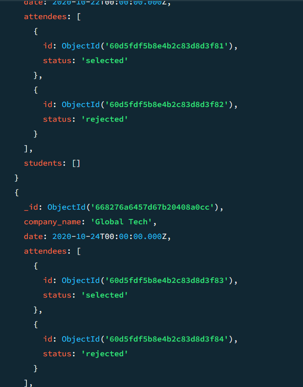

## MongoDB Task

# Design database for Zen class programme

**Entities:** 
   - users
   - codekata
   - attendance
   - topics
   - tasks
   - company_drives
   - mentors

**Relationships**

   - *Users and CodeKata:* One-to-many relationship (one user can have multiple CodeKata progress records).
   - *Users and Attendance:* One-to-many relationship (one user can have multiple attendance records).
   - *Users and Tasks:* One-to-many relationship (one user can have multiple tasks).
   - *Users and Company Drives:* Many-to-many relationship (one user can attend multiple drives, and one drive can have multiple users).
   - *Mentors and Users:* One-to-many relationship (one mentor can have multiple mentees).

**users table**
            
    db.users.insertMany([
                    {
                        name: "priya",
                        email: "priya123@example.com",
                        username: "priya1102",
                        password: "password123",
                        mobile: "1234567890",
                        dob: "1990-01-01",
                        gender: "Female",
                        years_of_experience: 5
                    },
                    {
                        name: "Srinath",
                        email: "srinathsp890@gmail.com",
                        username: "srii123",
                        password: "password123",
                        mobile: "0987654321",
                        dob: "1992-02-02",
                        gender: "Male",
                        years_of_experience: 3
                    },
                    {
                        name: "Chandru",
                        email: "chandru@gmail.com",
                        username: "chandru123",
                        password: "password123",
                        mobile: "1231231234",
                        dob: "1991-03-03",
                        gender: "Male",
                        years_of_experience: 4
                    },
                    {
                        name: "David",
                        email: "david@gmail.com",
                        username: "david567",
                        password: "password123",
                        mobile: "3213214321",
                        dob: "1993-04-04",
                        gender: "Male",
                        years_of_experience: 2
                    },
                    {
                        name: "riya",
                        email: "riyash23@gmail.com",
                        username: "riyas23",
                        password: "password123",
                        mobile: "9876543210",
                        dob: "1989-05-05",
                        gender: "Female",
                        years_of_experience: 6
                    }
                    ]);

    

**codekata table**
    db.codekata.insertMany([
                    {
                        user_id: ObjectId("60d5fdf5b8e4b2c83d8d3f80"),
                        problems_solved: [
                        { problem: "Problem 1", solution: "Solution 1" },
                        { problem: "Problem 2", solution: "Solution 2" }
                        ]
                    },
                    {
                        user_id: ObjectId("60d5fdf5b8e4b2c83d8d3f81"),
                        problems_solved: [
                        { problem: "Problem 3", solution: "Solution 3" },
                        { problem: "Problem 4", solution: "Solution 4" }
                        ]
                    },
                    {
                        user_id: ObjectId("60d5fdf5b8e4b2c83d8d3f82"),
                        problems_solved: [
                        { problem: "Problem 5", solution: "Solution 5" },
                        { problem: "Problem 6", solution: "Solution 6" }
                        ]
                    },
                    {
                        user_id: ObjectId("60d5fdf5b8e4b2c83d8d3f83"),
                        problems_solved: [
                        { problem: "Problem 7", solution: "Solution 7" },
                        { problem: "Problem 8", solution: "Solution 8" }
                        ]
                    },
                    {
                        user_id: ObjectId("60d5fdf5b8e4b2c83d8d3f84"),
                        problems_solved: [
                        { problem: "Problem 9", solution: "Solution 9" },
                        { problem: "Problem 10", solution: "Solution 10" }
                        ]
                    }
                    ]);

**Attendance table**

    db.attendance.insertMany([
                    { user_id: ObjectId("60d5fdf5b8e4b2c83d8d3f80"), date: ISODate("2020-10-15T00:00:00Z"), status: "present" },
                    { user_id: ObjectId("60d5fdf5b8e4b2c83d8d3f81"), date: ISODate("2020-10-15T00:00:00Z"), status: "absent" },
                    { user_id: ObjectId("60d5fdf5b8e4b2c83d8d3f82"), date: ISODate("2020-10-16T00:00:00Z"), status: "present" },
                    { user_id: ObjectId("60d5fdf5b8e4b2c83d8d3f83"), date: ISODate("2020-10-16T00:00:00Z"), status: "absent" },
                    { user_id: ObjectId("60d5fdf5b8e4b2c83d8d3f84"), date: ISODate("2020-10-16T00:00:00Z"), status: "present" }
                    ]);

**Topics table**
    db.topics.insertMany([
                    { title: "JavaScript Basics", description: "Introduction to JavaScript", date: ISODate("2020-10-01T00:00:00Z") },
                    { title: "MongoDB Aggregation", description: "Advanced MongoDB concepts", date: ISODate("2020-10-05T00:00:00Z") },
                    { title: "Node.js Introduction", description: "Introduction to Node.js", date: ISODate("2020-10-10T00:00:00Z") },
                    { title: "Express.js Middleware", description: "Middleware in Express.js", date: ISODate("2020-10-15T00:00:00Z") },
                    { title: "React Components", description: "Building React components", date: ISODate("2020-10-20T00:00:00Z") }
                    ]);

**Tasks table**

    db.tasks.insertMany([
                    {
                        title: "Build a basic website",
                        description: "Create a simple website using HTML, CSS, and JavaScript",
                        date: ISODate("2020-10-01T00:00:00Z"),
                        submissions: [
                        { user_id: ObjectId("60d5fdf5b8e4b2c83d8d3f80"), status: "submitted" },
                        { user_id: ObjectId("60d5fdf5b8e4b2c83d8d3f81"), status: "not submitted" }
                        ],
                        topic: ObjectId("60d5fdf5b8e4b2c83d8d3f90")
                    },
                    {
                        title: "Create MongoDB schema",
                        description: "Design a schema for MongoDB collections",
                        date: ISODate("2020-10-05T00:00:00Z"),
                        submissions: [
                        { user_id: ObjectId("60d5fdf5b8e4b2c83d8d3f82"), status: "submitted" },
                        { user_id: ObjectId("60d5fdf5b8e4b2c83d8d3f83"), status: "not submitted" }
                        ],
                        topic: ObjectId("60d5fdf5b8e4b2c83d8d3f91")
                    },
                    {
                        title: "Develop a REST API",
                        description: "Build a REST API using Node.js and Express",
                        date: ISODate("2020-10-10T00:00:00Z"),
                        submissions: [
                        { user_id: ObjectId("60d5fdf5b8e4b2c83d8d3f84"), status: "submitted" },
                        { user_id: ObjectId("60d5fdf5b8e4b2c83d8d3f80"), status: "not submitted" }
                        ],
                        topic: ObjectId("60d5fdf5b8e4b2c83d8d3f92")
                    },
                    {
                        title: "Implement authentication",
                        description: "Add authentication to your REST API",
                        date: ISODate("2020-10-15T00:00:00Z"),
                        submissions: [
                        { user_id: ObjectId("60d5fdf5b8e4b2c83d8d3f81"), status: "submitted" },
                        { user_id: ObjectId("60d5fdf5b8e4b2c83d8d3f82"), status: "not submitted" }
                        ],
                        topic: ObjectId("60d5fdf5b8e4b2c83d8d3f93")
                    },
                    {
                        title: "Build a React App",
                        description: "Create a React application",
                        date: ISODate("2020-10-20T00:00:00Z"),
                        submissions: [
                        { user_id: ObjectId("60d5fdf5b8e4b2c83d8d3f83"), status: "submitted" },
                        { user_id: ObjectId("60d5fdf5b8e4b2c83d8d3f84"), status: "not submitted" }
                        ],
                        topic: ObjectId("60d5fdf5b8e4b2c83d8d3f94")
                    }
                    ]);

**company_drives table**

    db.company_drives.insertMany([
                    {
                        company_name: "Tech Corp",
                        date: ISODate("2020-10-16T00:00:00Z"),
                        attendees: [
                        { id: ObjectId("60d5fdf5b8e4b2c83d8d3f80"), status: "selected" },
                        { id: ObjectId("60d5fdf5b8e4b2c83d8d3f81"), status: "rejected" }
                        ]
                    },
                    {
                        company_name: "Innovate Ltd",
                        date: ISODate("2020-10-18T00:00:00Z"),
                        attendees: [
                        { id: ObjectId("60d5fdf5b8e4b2c83d8d3f82"), status: "selected" },
                        { id: ObjectId("60d5fdf5b8e4b2c83d8d3f83"), status: "rejected" }
                        ]
                    },
                    {
                        company_name: "Future Solutions",
                        date: ISODate("2020-10-20T00:00:00Z"),
                        attendees: [
                        { id: ObjectId("60d5fdf5b8e4b2c83d8d3f84"), status: "selected" },
                        { id: ObjectId("60d5fdf5b8e4b2c83d8d3f80"), status: "rejected" }
                        ]
                    },
                    {
                        company_name: "NextGen Tech",
                        date: ISODate("2020-10-22T00:00:00Z"),
                        attendees: [
                        { id: ObjectId("60d5fdf5b8e4b2c83d8d3f81"), status: "selected" },
                        { id: ObjectId("60d5fdf5b8e4b2c83d8d3f82"), status: "rejected" }
                        ]
                    },
                    {
                        company_name: "Global Tech",
                        date: ISODate("2020-10-24T00:00:00Z"),
                        attendees: [
                        { id: ObjectId("60d5fdf5b8e4b2c83d8d3f83"), status: "selected" },
                        { id: ObjectId("60d5fdf5b8e4b2c83d8d3f84"), status: "rejected" }
                        ]
                    }
                    ]);

**Mentors table**

    db.mentors.insertMany([
                    {
                        name: "raju",
                        experience: 10,
                        email: "raju@gmail.com",
                        username: "raju123",
                        password: "password321",
                        mobile: "5551234567",
                        dob: "1980-01-01",
                        gender: "Male",
                        mentees: [
                        ObjectId("60d5fdf5b8e4b2c83d8d3f80"),
                        ObjectId("60d5fdf5b8e4b2c83d8d3f81"),
                        ObjectId("60d5fdf5b8e4b2c83d8d3f82")
                        ]
                    },
                    {
                        name: "maya",
                        experience: 8,
                        email: "maya@gmail.com",
                        username: "maya874",
                        password: "password321",
                        mobile: "5559876543",
                        dob: "1982-02-02",
                        gender: "Female",
                        mentees: [
                        ObjectId("60d5fdf5b8e4b2c83d8d3f83"),
                        ObjectId("60d5fdf5b8e4b2c83d8d3f84"),
                        ObjectId("60d5fdf5b8e4b2c83d8d3f80")
                        ]
                    },
                    {
                        name: "Abi",
                        experience: 7,
                        email: "abi@gmail.com",
                        username: "abi598",
                        password: "password321",
                        mobile: "5556781234",
                        dob: "1985-03-03",
                        gender: "Female",
                        mentees: [
                        ObjectId("60d5fdf5b8e4b2c83d8d3f81"),
                        ObjectId("60d5fdf5b8e4b2c83d8d3f82"),
                        ObjectId("60d5fdf5b8e4b2c83d8d3f83"),
                        ObjectId("60d5fdf5b8e4b2c83d8d3f84")
                        ]
                    },
                    {
                        name: "bala",
                        experience: 6,
                        email: "bala@gmail.com",
                        username: "bala7895",
                        password: "password321",
                        mobile: "5553219876",
                        dob: "1987-04-04",
                        gender: "Male",
                        mentees: [
                        ObjectId("60d5fdf5b8e4b2c83d8d3f80"),
                        ObjectId("60d5fdf5b8e4b2c83d8d3f81"),
                        ObjectId("60d5fdf5b8e4b2c83d8d3f82"),
                        ObjectId("60d5fdf5b8e4b2c83d8d3f83"),
                        ObjectId("60d5fdf5b8e4b2c83d8d3f84")
                        ]
                    },
                    {
                        name: "layla",
                        experience: 5,
                        email: "layla@gmail.com",
                        username: "layla123",
                        password: "password321",
                        mobile: "5557894321",
                        dob: "1990-05-05",
                        gender: "Female",
                        mentees: [
                        ObjectId("60d5fdf5b8e4b2c83d8d3f80"),
                        ObjectId("60d5fdf5b8e4b2c83d8d3f81"),
                        ObjectId("60d5fdf5b8e4b2c83d8d3f82"),
                        ObjectId("60d5fdf5b8e4b2c83d8d3f83"),
                        ObjectId("60d5fdf5b8e4b2c83d8d3f84")
                        ]
                    }
                    ]);

1. *Find all the topics and tasks which are thought in the month of October.*

  **Query:**
        
     db.tasks.find({
            date: {
                $gte: ISODate("2020-10-01T00:00:00Z"),
                $lt: ISODate("2020-11-01T00:00:00Z")
            }
            });

 **Output:**

        

2. *Find all the company drives which appeared between 15 oct-2020 and 31-oct-2020.*
   
  **Query:**

        db.company_drives.find({
                    date: {
                        $gte: ISODate("2020-10-15T00:00:00Z"),
                        $lt: ISODate("2020-11-01T00:00:00Z")
                    }
                    });

 **Output:**

      

3. *Find all the company drives and students who are appeared for the placement.*
   
 **Query:**
          
         db.company_drives.aggregate([
                {
                    $lookup: {
                    from: "users",
                    localField: "attendees.id",
                    foreignField: "_id",
                    as: "students"
                    }
                }
                ]);

 **Output:**
 
    

4. *Find the number of problems solved by the user in codekata.*
   
 **Query:**
          
       db.codekata.aggregate([
                {
                    $project: {
                    user_id: 1,
                    problems_solved_count: { $size: "$problems_solved" }
                    }
                }
                ]);

 **Output:**

  

5. *Find all the mentors with who has the mentee's count more than 15*
   
 **Query:**
          
      db.mentors.find({
            $expr: { $gt: [{ $size: "$mentees" }, 15] }
            });

 **Output:**
   
      Null
 
6. *Find the number of users who are absent and tasks not submitted between 15-Oct-2020 and 31-Oct-2020*

 **Query:** 

      db.attendance.aggregate([
                {
                    $match: {
                    date: { $gte: ISODate("2020-10-15T00:00:00Z"), $lt: ISODate("2020-11-01T00:00:00Z") },
                    status: "absent"
                    }
                },
                {
                    $lookup: {
                    from: "tasks",
                    let: { userId: "$user_id" },
                    pipeline: [
                        { $unwind: "$submissions" },
                        { $match: { $expr: { $and: [ { $eq: ["$submissions.user_id", "$$userId"] }, { $eq: ["$submissions.status", "not submitted"] } ] } } }
                    ],
                    as: "unsubmitted_tasks"
                    }
                },
                {
                    $match: { "unsubmitted_tasks.0": { $exists: true } }
                },
                {
                    $count: "users_absent_and_tasks_not_submitted"
                }
                ]);

 **Output:**
  
   
